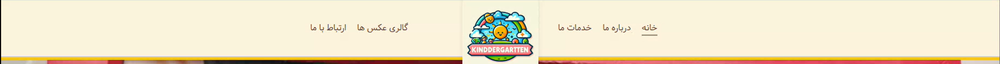
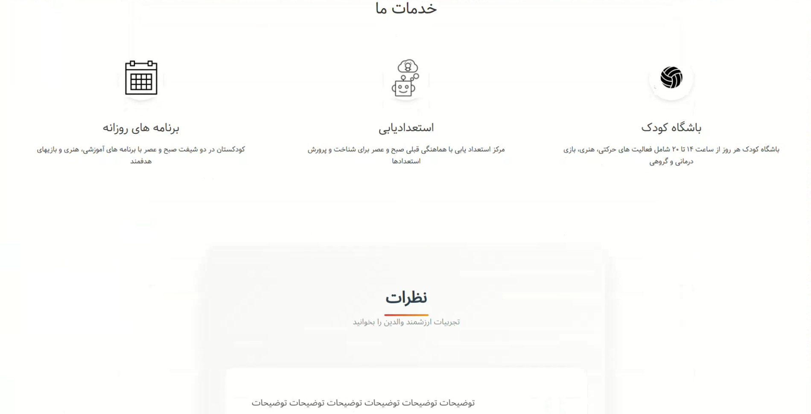
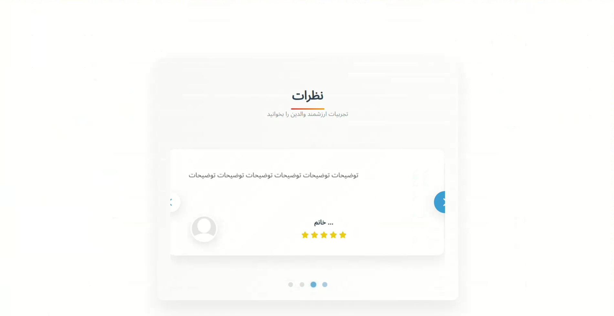
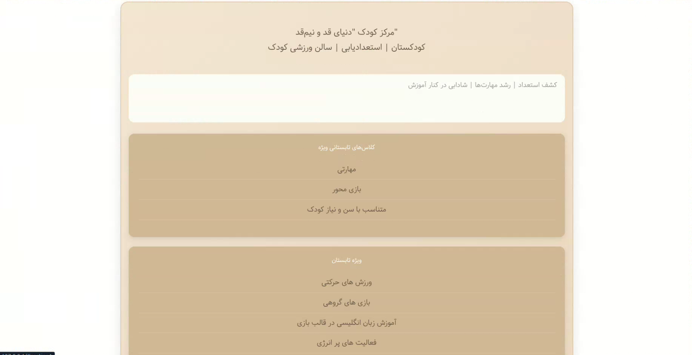

# 🧸 Donyaye Ghad Nimghad

A modern and responsive kindergarten website designed to introduce the kindergarten, showcase its facilities and activities, display a photo gallery, and provide an easy way for parents and visitors to learn more about the kindergarten.

<p align="center">
  
  
  
  
  
</p>

---

## 📌 About The Project

**Donyaye Ghad Nimghad** is a modern kindergarten website developed to introduce the kindergarten, its facilities, activities, and services in a simple, friendly, and visually appealing interface.

The website includes different sections for presenting information about the kindergarten, displaying available facilities, showcasing educational and recreational activities, presenting a photo gallery, and collecting visitors' comments and opinions.

The project focuses on a **clean user interface, responsive design, attractive visual presentation, and an easy-to-use experience for parents and visitors**.

---

## ✨ Features

| Feature                      | Description                                                      |
| ---------------------------- | ---------------------------------------------------------------- |
| 🏫 Kindergarten Introduction | Introduction and general information about the kindergarten      |
| 🎨 Facilities                | Display of kindergarten facilities and available services        |
| 📸 Photo Gallery             | Gallery for displaying photos of the kindergarten and activities |
| 💬 Comments                  | Visitors can share their opinions and feedback                   |
| 🎯 Activities                | Presentation of educational and recreational activities          |
| 👩‍🏫 Staff Information      | Section for introducing teachers and kindergarten staff          |
| 📰 News & Announcements      | Display of important news and announcements                      |
| 📞 Contact Section           | Contact information for parents and visitors                     |
| 📱 Responsive Design         | Optimized for desktop, tablet, and mobile devices                |
| 🎨 Modern UI                 | Friendly and visually appealing interface                        |

---

## 🛠️ Tech Stack

<p align="center">
  
  
  
  
  
</p>

---

# 📸 Screenshots

<p align="center">
  
</p>

<p align="center">
  
</p>

<p align="center">
  
</p>

<p align="center">
  
</p>

---

# 📂 Project Structure

```text
donyaye-ghad-nimghad/
│
├── index.php
├── css/
│   └── ...
│
├── js/
│   └── ...
│
├── images/
│   └── ...
│
├── assets/
│   └── ...
│
└── ...
```

---

# 💡 Project Highlights

### 🏫 Kindergarten Introduction

A dedicated section for introducing **Donyaye Ghad Nimghad**, its environment, goals, and general information.

### 🎨 Facilities & Services

The website provides an attractive way to introduce the available facilities and services of the kindergarten.

### 📸 Photo Gallery

A dedicated photo gallery allows visitors to explore photos of the kindergarten environment, activities, events, and different moments.

### 💬 Visitor Comments

Visitors can share their opinions and feedback through the comments section.

### 🎯 Educational & Recreational Activities

Different educational and recreational activities can be presented to parents and visitors to provide a better understanding of the kindergarten's programs.

### 👩‍🏫 Staff Introduction

A section for introducing teachers and kindergarten staff helps parents become more familiar with the kindergarten team.

### 📰 News & Announcements

Important news, announcements, events, and updates can be presented to visitors.

### 📞 Contact Information

A dedicated contact section makes it easier for parents and visitors to find the kindergarten's contact information.

### 📱 Responsive Interface

The website is designed to provide a suitable experience across different screen sizes, including mobile phones, tablets, and desktop computers.

---

# 🔮 Future Improvements

* Online kindergarten registration
* Parent account system
* Online communication between parents and kindergarten
* Event calendar
* Online application forms
* Notification system
* Advanced gallery management
* Parent dashboard
* Online activity schedule

---

# 👨‍💻 Developer

**Mohammad Amin Jorian**

<p align="center">
  <a href="https://github.com/MohammadAminJorian">
    
  </a>
  <a href="https://mohammadaminjorian.github.io/Portfolio/">
    
  </a>
</p>

---

# ❤️ Support

If you find this project useful or interesting, consider giving the repository a ⭐ on GitHub.

---

# 🇮🇷 نسخه فارسی

# 🧸 دنیای قد و نیم قد

یک وبسایت مدرن و ریسپانسیو برای مهدکودک **دنیای قد و نیم قد** که با هدف معرفی مهدکودک، نمایش امکانات و فعالیت‌ها، ارائه گالری تصاویر و ایجاد ارتباط بهتر با والدین و بازدیدکنندگان طراحی شده است.

---

## 📌 درباره پروژه

**دنیای قد و نیم قد** یک وبسایت مدرن برای مهدکودک است که با هدف معرفی مجموعه، امکانات، فعالیت‌ها و خدمات آن در محیطی ساده، زیبا و کاربرپسند طراحی شده است.

این وبسایت شامل بخش‌های مختلفی برای معرفی مهدکودک، نمایش امکانات، معرفی فعالیت‌های آموزشی و تفریحی، نمایش گالری تصاویر و دریافت نظرات بازدیدکنندگان است.

تمرکز پروژه بر روی **رابط کاربری زیبا، طراحی ریسپانسیو، ظاهر جذاب و ایجاد تجربه کاربری مناسب برای والدین و بازدیدکنندگان** بوده است.

---

## ✨ امکانات

| امکان                 | توضیحات                                           |
| --------------------- | ------------------------------------------------- |
| 🏫 معرفی مهدکودک      | معرفی مجموعه و ارائه اطلاعات کلی درباره مهدکودک   |
| 🎨 امکانات            | نمایش امکانات و خدمات موجود در مهدکودک            |
| 📸 گالری تصاویر       | نمایش تصاویر محیط، فعالیت‌ها و برنامه‌های مهدکودک |
| 💬 نظرات              | امکان ثبت نظر و دیدگاه بازدیدکنندگان              |
| 🎯 فعالیت‌ها          | معرفی فعالیت‌های آموزشی و تفریحی                  |
| 👩‍🏫 معرفی مربیان    | بخش معرفی مربیان و اعضای مجموعه                   |
| 📰 اخبار و اطلاعیه‌ها | نمایش اخبار و اطلاعیه‌های مهم                     |
| 📞 ارتباط با ما       | نمایش اطلاعات تماس برای والدین و بازدیدکنندگان    |
| 📱 طراحی ریسپانسیو    | نمایش مناسب در موبایل، تبلت و کامپیوتر            |
| 🎨 رابط کاربری مدرن   | طراحی زیبا و مناسب برای فضای مهدکودک              |

---

## 🛠️ تکنولوژی‌های استفاده شده

<p align="center">
  
  
  
  
  
</p>

---

# 📸 تصاویر پروژه

<p align="center">
  
</p>

<p align="center">
  
</p>

<p align="center">
  
</p>

<p align="center">
  
</p>

---

# 📂 ساختار پروژه

```text
donyaye-ghad-nimghad/
│
├── index.php
├── css/
│   └── ...
│
├── js/
│   └── ...
│
├── images/
│   └── ...
│
├── assets/
│   └── ...
│
└── ...
```

---

# 💡 بخش‌های مهم پروژه

### 🏫 معرفی مهدکودک

بخشی برای معرفی **دنیای قد نیم قد**، محیط، اهداف و اطلاعات کلی مجموعه.

### 🎨 امکانات و خدمات

نمایش امکانات و خدمات مهدکودک به صورت زیبا و قابل دسترس برای والدین.

### 📸 گالری تصاویر

گالری اختصاصی برای نمایش تصاویر محیط مهدکودک، فعالیت‌ها، رویدادها و لحظات مختلف.

### 💬 نظرات کاربران

امکان ثبت نظرات و دیدگاه‌های بازدیدکنندگان و والدین.

### 🎯 فعالیت‌های آموزشی و تفریحی

معرفی برنامه‌ها و فعالیت‌های آموزشی و تفریحی برای آشنایی بیشتر والدین با برنامه‌های مهدکودک.

### 👩‍🏫 معرفی مربیان

بخش معرفی مربیان و اعضای مجموعه برای آشنایی بیشتر والدین با تیم مهدکودک.

### 📰 اخبار و اطلاعیه‌ها

نمایش اخبار، اطلاعیه‌ها، رویدادها و به‌روزرسانی‌های مهم مهدکودک.

### 📞 اطلاعات تماس

بخش اختصاصی برای نمایش اطلاعات تماس و راه‌های ارتباطی با مهدکودک.

### 📱 رابط کاربری ریسپانسیو

طراحی مناسب برای نمایش در دستگاه‌های مختلف مانند موبایل، تبلت و کامپیوتر.

---

# 🔮 امکانات قابل توسعه

* ثبت‌نام آنلاین کودکان
* ایجاد حساب کاربری والدین
* ارتباط آنلاین والدین با مهدکودک
* تقویم رویدادها
* فرم‌های آنلاین ثبت‌نام
* سیستم اطلاع‌رسانی
* مدیریت پیشرفته‌تر گالری
* داشبورد اختصاصی والدین
* نمایش برنامه فعالیت‌های روزانه

---

# 👨‍💻 توسعه‌دهنده

**Mohammad Amin Jorian**

<p align="center">
  <a href="https://github.com/MohammadAminJorian">
    
  </a>
  <a href="https://mohammadaminjorian.github.io/Portfolio/">
    
  </a>
</p>

---

# ❤️ حمایت

اگر این پروژه برای شما جالب یا مفید بود، با ⭐ دادن به ریپازیتوری در GitHub از پروژه حمایت کنید.
